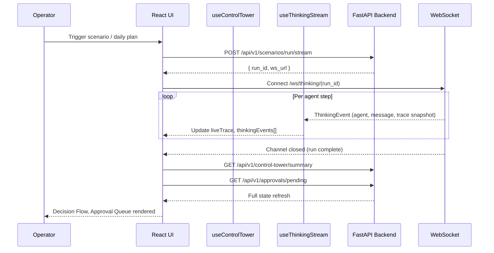

<div align="center">

# ChainCopilot — Control Tower UI

**A real-time supply chain control tower interface for the ChainCopilot agent backend.**

This dashboard gives supply chain operators a live view into autonomous agent reasoning, disruption response plans, KPI projections, human-in-the-loop approval workflows, and execution tracking — all streamed in real time from the ChainCopilot backend.

---

[](https://react.dev)
[](https://www.typescriptlang.org)
[](https://vitejs.dev)
[](https://tailwindcss.com)
[](https://recharts.org)
[](https://www.radix-ui.com)
[](https://developer.mozilla.org/en-US/docs/Web/API/WebSocket)

---

### Tech Stack


</div>

---

## Overview

The ChainCopilot Control Tower UI is a single-page React application that serves as the operator interface for the ChainCopilot agent backend. It provides:

- A **live agent reasoning panel** that streams each agent's thinking as it happens over WebSocket
- A **decision flow view** that shows why a plan was selected, what alternatives were evaluated, and what the critic said
- A **human-in-the-loop approval queue** for reviewing, approving, rejecting, or promoting alternative strategies
- A **run ledger** with full trace, state snapshot, and decision log for every historical run
- An **execution pipeline** for tracking dispatched actions through to completion
- A **KPI dashboard** and **inventory / supplier tables** for situational awareness

---

## Features

| Panel | Description |
| :--- | :--- |
| **Plan Generation** | Real-time agent thinking stream with per-step status indicators; displays the current trace as it builds |
| **Control Tower (Agent)** | Five-stage workflow view (Monitor → Assess → Plan → Approve → Learn) with workspace switching |
| **Operations Console** | Live KPI cards, active event feed, one-click plan generation |
| **Decision Flow** | Full explainability: winning factors, alternative strategies, critic review, constraint violations, projected KPI delta cards (T+1/T+2/T+3), historical case matches |
| **Approval Queue** | Pending decision detail, alternative plan cards, approve / reject / safer-plan actions, alternative strategy promotion |
| **Execution Dashboard** | Plan action list, dispatch progress, execution status tracking |
| **Run Ledger** | Paginated run history, per-run trace viewer, state snapshot, decision log detail, execution timeline with collapsible steps |
| **Reflection Memory** | Reflection notes from the learning loop, pattern tag frequency, scenario outcome history |
| **Inventory Table** | Filterable SKU list with status, on-hand, safety stock, and reorder point |
| **Suppliers Table** | Supplier list with reliability scores, lead times, and SKU relationships |
| **Global Scenario Widget** | Persistent floating widget for triggering and resetting disruption scenarios |

---

## Application Structure

### Navigation Tabs

```
Dashboard           -- KPI overview and network health summary
Inventory           -- 50-SKU inventory table with filtering
Suppliers           -- Supplier reliability and lead-time view
Plan Generation     -- Real-time agent stream + trace panel
Control Tower       -- Full agent workspace (Decision Flow, Approval, Execution)
Run Ledger          -- Historical run audit trail
```

### Component Architecture

```mermaid
graph TD
    App["App.tsx — Root component, tab routing, stream orchestration"]

    App --> Layout["Layout.tsx — Navigation shell, tab bar, service runtime indicator"]
    App --> GlobalWidget["GlobalScenarioWidget — Floating scenario trigger & reset"]

    App --> PG["PlanGeneration — Streaming agent trace viewer"]
    App --> Dashboard["Dashboard — KPI cards, network summary"]
    App --> Inventory["Inventory — SKU table"]
    App --> Suppliers["Suppliers — Supplier table"]
    App --> Agent["Agent.tsx — Control Tower orchestrator"]
    App --> Ledger["RunLedgerPage — Historical run viewer"]

    Agent --> ControlTowerHeader["ControlTowerHeader — Mode badge, status"]
    Agent --> ActiveWorkSection["ActiveWorkSection — In-progress indicator"]
    Agent --> WorkflowSection["WorkflowSection — 5-stage workflow + workspace tabs"]
    Agent --> OperationsConsole["OperationsConsole — KPI panel, action buttons"]
    Agent --> EventFeedPanel["EventFeedPanel — Active event list"]
    Agent --> DecisionFlow["DecisionFlow — Full explainability view"]
    Agent --> ApprovalQueue["ApprovalQueue — Human approval interface"]
    Agent --> ExecutionDashboard["ExecutionDashboard — Action dispatch tracker"]
    Agent --> ReflectionMemoryPanel["ReflectionMemoryPanel — Learning loop output"]

    Ledger --> RunLedger["RunLedger — Run list + detail accordion"]
```



### Data Flow



---

## Folder Structure

```
supply-chain-management/scm-demo/
├── src/
│   ├── App.tsx                         # Root: tab routing, stream orchestration
│   ├── main.tsx                        # React entry point
│   │
│   ├── components/
│   │   ├── Layout.tsx                  # Navigation shell, sidebar, tab bar
│   │   ├── Dashboard.tsx               # KPI summary dashboard
│   │   ├── Inventory.tsx               # SKU inventory table
│   │   ├── Suppliers.tsx               # Supplier table
│   │   ├── PlanGeneration.tsx          # Streaming agent trace view
│   │   ├── RunLedgerPage.tsx           # Run ledger page wrapper
│   │   ├── GlobalScenarioWidget.tsx    # Floating scenario control widget
│   │   │
│   │   └── agent/                      # Control Tower sub-components
│   │       ├── Agent.tsx               # (root export) — re-exported via components/Agent.tsx
│   │       ├── ControlTowerHeader.tsx  # Operating mode badge and title
│   │       ├── ActiveWorkSection.tsx   # In-progress work indicator
│   │       ├── WorkflowSection.tsx     # 5-stage workflow + workspace switcher
│   │       ├── OperationsConsole.tsx   # KPI cards, work queue, action buttons
│   │       ├── EventFeedPanel.tsx      # Active disruption event list
│   │       ├── DecisionFlow.tsx        # Full plan explainability panel
│   │       ├── ApprovalQueue.tsx       # Human-in-the-loop approval interface
│   │       ├── ExecutionDashboard.tsx  # Execution tracking panel
│   │       ├── ReflectionMemoryPanel.tsx # Learning loop output viewer
│   │       ├── RunLedger.tsx           # Historical run list and detail viewer
│   │       └── AgentShared.tsx         # Shared types, utilities, and helpers
│   │
│   ├── hooks/
│   │   ├── useControlTower.ts          # Primary data hook: REST polling, actions
│   │   └── useThinkingStream.ts        # WebSocket stream hook for agent reasoning
│   │
│   └── lib/
│       ├── types.ts                    # All TypeScript interface definitions
│       └── presenters.ts              # Display formatting utilities
│
├── public/
├── index.html
├── vite.config.ts
├── tailwind.config.js
├── tsconfig.app.json
└── package.json
```

---

## Installation

### Prerequisites

- Node.js 18 or higher
- The ChainCopilot backend running on `http://localhost:8000`

### Steps

```bash
# 1. Navigate to the frontend directory
cd supply-chain-management/scm-demo

# 2. Install dependencies
npm install
# or
yarn install

# 3. Configure the environment
cp .env.example .env
# Edit .env to set VITE_API_URL if the backend is not on localhost:8000

# 4. Start the development server
npm run dev
# The UI will be available at http://localhost:5173
```

---

## Environment Variables

Create a `.env` file in the `scm-demo/` directory:

| Variable | Default | Description |
| :--- | :--- | :--- |
| `VITE_API_URL` | `http://localhost:8000` | Base URL of the ChainCopilot backend REST API |

> The WebSocket URL is derived automatically from `VITE_API_URL` by replacing the `http` scheme with `ws`.

---

## Usage Guide

### Starting a Daily Planning Cycle

1. Navigate to the **Plan Generation** tab.
2. Click **Generate Recommendations**.
3. Watch each agent (Risk, Supplier/Logistics/Demand, Inventory, Planner, Critic) stream its reasoning in real time.
4. Once the stream completes, the trace panel shows the selected strategy, projected KPIs, and whether approval is required.

### Running a Disruption Scenario

1. Use the **Global Scenario Widget** (bottom-right of every page) to select a scenario:
   - `supplier_delay` — SUP_BN 48-hour delay affecting 17 SKUs
   - `demand_spike` — SKU_024/013/036 demand surge
   - `route_blockage` — R_BN_HN_MAIN flood blockage
   - `compound_disruption` — All three combined
2. Click **Run Scenario** and watch the agent stream.
3. The system will enter **CRISIS** mode and generate a `resilience_first` recovery plan.

### Reviewing a Decision

1. After a plan is generated, navigate to **Control Tower**.
2. The **Decision Flow** panel shows:
   - Why the winning strategy was selected (priority score breakdown)
   - What alternatives were evaluated and why they were ranked lower
   - Critic findings and identified risks
   - Projected KPI timeline: service level, disruption risk, recovery speed at T+1, T+2, T+3
   - Historical case matches that informed the decision

### Approving or Rejecting a Plan

1. If approval is required, the **Approval Queue** workspace tab becomes active.
2. Switch to **Approval Queue** to review:
   - The full decision detail and approval reason
   - Alternative strategy cards with comparative KPI deltas
3. Choose one of:
   - **Approve and Execute** — confirms the recommended plan and dispatches actions
   - **Request Safer Plan** — regenerates a more conservative alternative
   - **Reject** — cancels the plan and returns to monitoring
   - **Promote Alternative** — selects a different strategy (e.g., `balanced` instead of `resilience_first`)

### Reviewing Run History

1. Navigate to **Run Ledger**.
2. Select any past run from the list.
3. The detail panel shows:
   - Run metadata (scenario, duration, status, selected strategy)
   - Full agent-by-agent execution trace with collapsible step details
   - State snapshot (KPIs, mode, inventory at time of run)
   - Decision log with winning factors and rejection reasons
   - Execution record if actions were dispatched

---

## Build for Production

```bash
# Type-check and build the production bundle
npm run build

# Preview the production build locally
npm run preview
```

Output is generated in the `dist/` directory and can be served from any static host.

---

## Linting

```bash
# Run ESLint
npm run lint
```

---

## Key Design Decisions

**WebSocket + polling hybrid.** The `useThinkingStream` hook opens a WebSocket connection during active agent execution and streams `ThinkingEvent` objects per agent step. When the stream completes, `useControlTower` performs a full REST poll to reconcile final persisted state. This avoids full-state pushes over WebSocket while still giving operators a live experience.

**Workspace-scoped rendering.** The Control Tower view uses a `WorkspaceView` enum (`operations`, `approval`, `execution`) to conditionally mount only the relevant panel. This keeps the component tree shallow and prevents stale data between views.

**Trace-first data model.** The `TraceView` type is the single source of truth for the UI. All panels — Decision Flow, Approval Queue, Execution Dashboard — derive their data from the latest trace rather than maintaining independent state slices. This eliminates synchronization bugs between panels.

**Deterministic presenters.** All display formatting (status humanization, strategy labels, KPI formatting) is centralized in `lib/presenters.ts` so the same string representations appear consistently across every panel.

